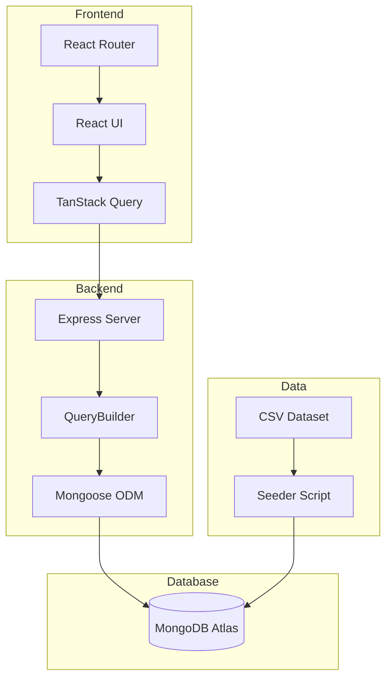

# TruEstate System Architecture

## Overview

TruEstate is a full-stack retail sales management system designed for handling large-scale transaction data with powerful search, filter, and export capabilities.

## System Architecture



## Technology Stack

| Layer | Technology | Purpose |
|-------|------------|---------|
| Frontend | React 18 | UI Components |
| State | TanStack Query v5 | Server state management |
| Styling | Tailwind CSS 3 | Utility-first CSS |
| Icons | Lucide React | Icon library |
| Routing | React Router v6 | Client-side routing |
| Backend | Express.js | REST API |
| ODM | Mongoose 8 | MongoDB object modeling |
| Database | MongoDB Atlas | Cloud document storage |
| CSV | csv-parser | Data ingestion |

## Known Limitations

### MongoDB Atlas Free Tier (M0)

| Limitation | Impact |
|------------|--------|
| **512 MB storage limit** | Only 830,000 of 1,000,000 records could be seeded |
| **Shared cluster** | May experience slower query times during peak usage |
| **No dedicated resources** | Performance varies based on cluster load |

**Workaround Options:**
1. Use local MongoDB for development (unlimited storage)
2. Upgrade to Atlas M10+ for production (~$57/month)
3. Work with the 830K records (sufficient for demo purposes)

### CSV Data Handling
- The `Tags` field contains quoted comma-separated values (e.g., `"organic,skincare"`)
- csv-parser handles this correctly; manual parsing would fail

### Export Limitations
- CSV export capped at 50,000 records to prevent memory issues
- For larger exports, use MongoDB Compass or mongodump

## Core Components

### Backend

#### QueryBuilder (`services/QueryBuilder.js`)
Dynamic query construction that avoids complex if/else chains:
- Keyword search with regex across customer name, phone, product name
- Multi-select filters using `$in` operator
- Range filters using `$gte/$lte`
- Sorting with field mapping

#### Transaction Model (`models/Transaction.js`)
Schema with:
- 26 fields mapping to CSV columns
- Text index on customerName, productName
- Compound indexes for common filter combinations
- Virtual `formattedDate` property

#### Seeder (`utils/seeder.js`)
High-performance CSV ingestion:
- Uses native MongoDB driver (bypasses Mongoose for speed)
- Batch insertion with 1000 records per batch
- Sequential processing for Atlas compatibility
- Creates indexes after data insertion

### Frontend

#### State Management
- URL-first approach with `useSearchParams`
- TanStack Query for server state caching
- Filter state persisted in URL for shareability

#### Components
| Component | Purpose |
|-----------|---------|
| `TransactionTable` | Sortable data grid with status badges |
| `FilterPanel` | Accordion-style multi-select filters |
| `SearchBar` | Debounced search input (300ms) |
| `Pagination` | Page navigation with info |

## API Endpoints

| Method | Endpoint | Description |
|--------|----------|-------------|
| GET | `/api/transactions` | Paginated list with filters |
| GET | `/api/transactions/:id` | Single transaction by ID |
| GET | `/api/transactions/filters` | Filter dropdown options |
| GET | `/api/transactions/export` | CSV export (max 50K) |
| GET | `/api/transactions/stats` | Aggregated statistics (supports filters) |

## Data Flow

1. **User Interaction** → URL params updated
2. **URL Change** → TanStack Query triggers fetch
3. **API Request** → QueryBuilder constructs MongoDB query
4. **Query Execution** → Mongoose executes with indexes
5. **Response** → Data cached by TanStack Query
6. **Render** → React components display data

## Performance Optimizations

| Optimization | Benefit |
|--------------|---------|
| MongoDB indexes | Faster queries on filtered fields |
| Batch insertion | Efficient seeding of large datasets |
| TanStack Query caching | Reduced API calls, instant back navigation |
| Debounced search | Prevents excessive API calls while typing |
| Sequential Atlas inserts | Avoids connection pool exhaustion |

## File Structure

```
TruEstate/
├── backend/
│   ├── src/
│   │   ├── controllers/transactionController.js
│   │   ├── models/Transaction.js
│   │   ├── routes/transactionRoutes.js
│   │   ├── services/QueryBuilder.js
│   │   ├── utils/seeder.js
│   │   └── index.js
│   ├── .env
│   ├── package.json
│   └── README.md
├── frontend/
│   ├── public/
│   │   └── favicon.svg
│   ├── src/
│   │   ├── components/
│   │   │   ├── TransactionTable.jsx
│   │   │   ├── FilterPanel.jsx
│   │   │   ├── SearchBar.jsx
│   │   │   └── Pagination.jsx
│   │   ├── hooks/useTransactions.js
│   │   ├── services/api.js
│   │   ├── styles/index.css
│   │   ├── App.jsx
│   │   └── main.jsx
│   ├── index.html
│   ├── package.json
│   ├── tailwind.config.js
│   └── vite.config.js
├── docs/
│   └── architecture.md
└── truestate_assignment_dataset.csv (235MB)
```
